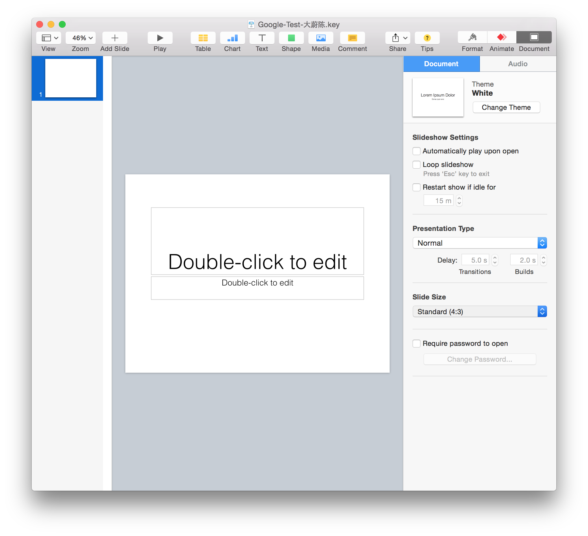
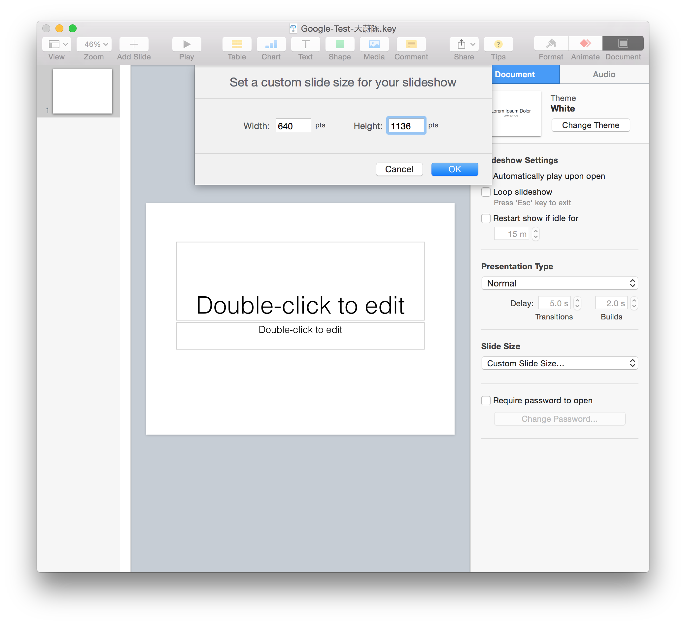
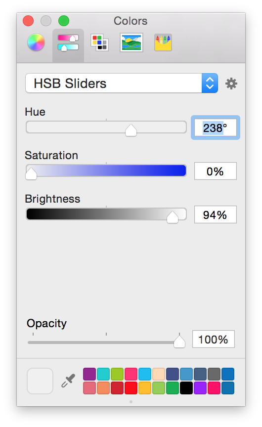
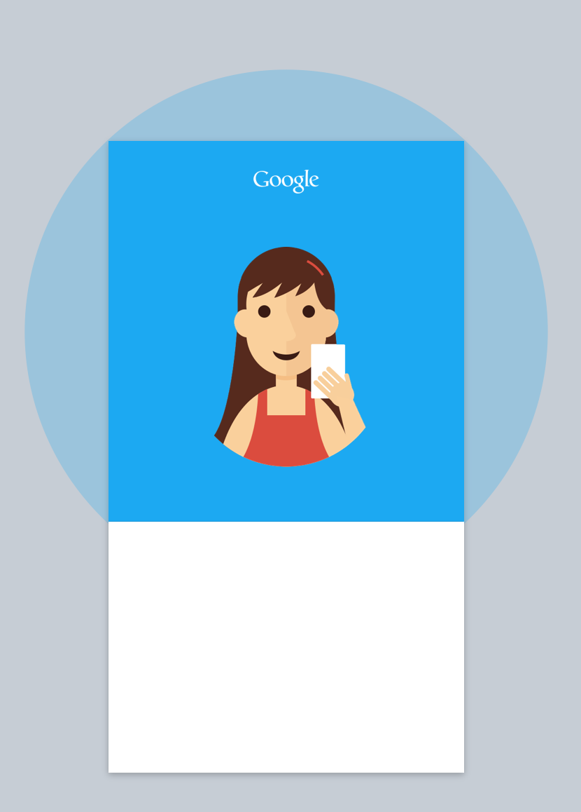
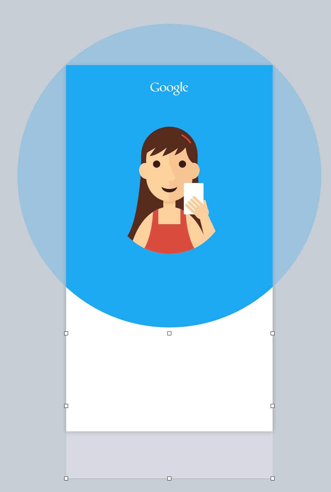
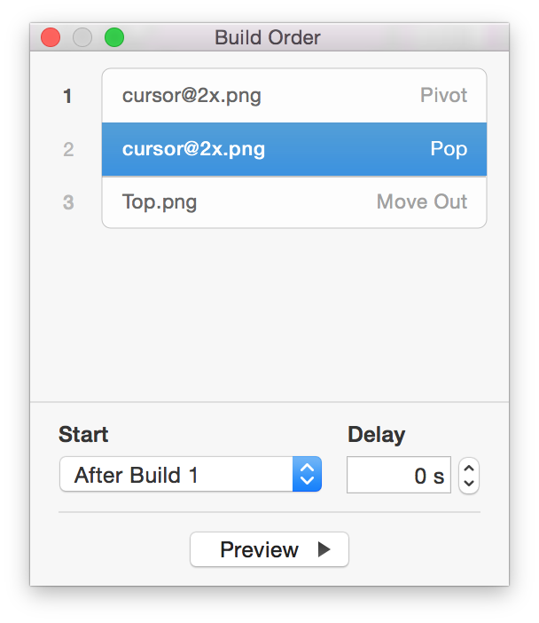
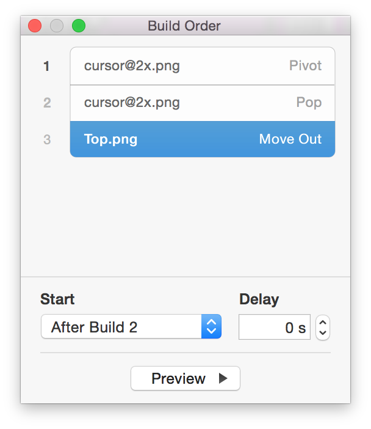

## 用 Keynote 制作交互动效设计

先看简单效果

<video width="300" height="540" src="./assets/google-test.mp4" controls="controls">
</video>

### 准备工作

- 硬件准备：Mac

- 软件准备：Keynote

- 素材资源（如果你想自己画的话，也没问题）：Google Logo, Avantar, Android L Icons，Roboto 字体

### 第一步，基本设置

新建一个 Keynote 文件，然后在 **文档** 的 **幻灯片尺寸** 中选择 **定制幻灯片尺寸**，并在输入框中输入宽为：640，高为：1136。我一般选择使用 iPhone5 的分辨率，以免尺寸过大导致的投影效果欠佳。

---

在 **格式** 中选择 **背景颜色**，输入 H:238 S:0 B:94。RGB 对机器友好，但 HSB 是对人更友好的色彩模式，推荐使用 HSB 模式。

---

### 第二步，画图

我图方便，顶部条部分直接在 Sketch 里画了图，导成 PNG 放在 Keynote 里。其实 Keynote 里也同样可以完成这个操作，下面就介绍下 keynote 里如何完成：

1. 自行绘制。Keynote 中的钢笔工具非常强大，你可以绘制任何你想要的图形，同时也可以让图形之间合并，相减相交。但是缺点是无法导成单独的图片。
2. 运用资源：图标字体，IconFont，安装此图标字体，即可使用。优点是你可以任意放大缩小不失真，缺点也很明显，要导出图片是麻烦的事情。

其他都较为简单，就不多赘述。

唯一需要注意的是在第二页中，并不是简单的一个矩形背景，而是由圆和矩形拼接成的。稍后介绍动效时，会介绍到 Magic Move 的运用。

---

### 第三步，添加动效

画好图之后，就可以添加动效了。其实我们分析一下就知道点击头像后，两个页面的交互动效是如何的：

1. 头像后的原型放大，并最后形成一个矩形。
2. 顶部条有轻微的上移渐隐效果。
3. 第二页的标题，文字等上移
4. 麦克风出现
5. 头像背后的圆放大并持续一小段时间

当然，哪个象征光标的圆圈也是有一个移入，并进行 Pop 效果的。

Keynote 里的 Magic Move（神奇移动），真的很 Magic，兼职就是无缝衔接。当你运用 Magic Move 时，注意要是相同的两个对象。比如说在这个 Demo 里，你把第一页中的蓝色圆背景，复制，黏贴到第二页，同时放大尺寸，那么在运用 Magic Move 之后，过渡就会非常自然。

同时，Build Order（构件顺序）也是非常重要的，你在此选择动效的持续时间，是否运用延迟，在点击还是在某构建之后开始。其中的妙处是需要自己去把玩的，说一百遍不如实地做一遍。

### 优化一下

1. 复制第二页的标题和文字到第一页的画布底下。

1. 把首页中底部的矩形背景复制到第二页，然后调整其高度为450，

这样，运用 Magic Move 的时候，就会更自然了。

### 最后几句

其实页面还有很多可以进化的地方，各位可以再试试。

现在有很多的工具可以帮助我们展现 Demo，比如说 Origami, Form，Framer Studio，InVision，Adobe Effects，Xcode，等等等等。

这些工具各有各的优势，也各自存在缺点。比如说同样这个 Demo，用 Framerjs 来做的话，都快200行代码了（前提还是你得画好图），但是用 Keynote 去做，连画图带动效，也就两页。

按照时间和要求的不同，选择合适的工具，才是最好的。更为重要的是你的想法，毕竟，这些都只是用来实现你得想法的。